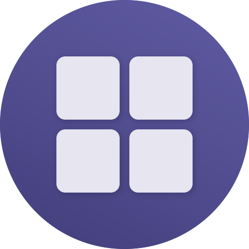
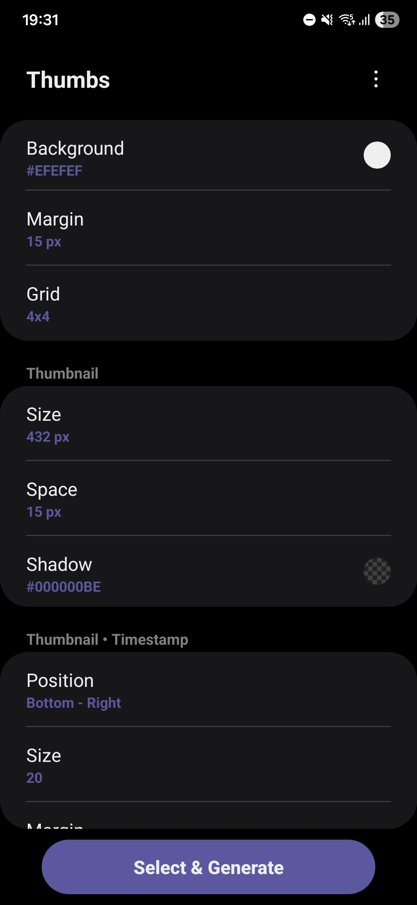
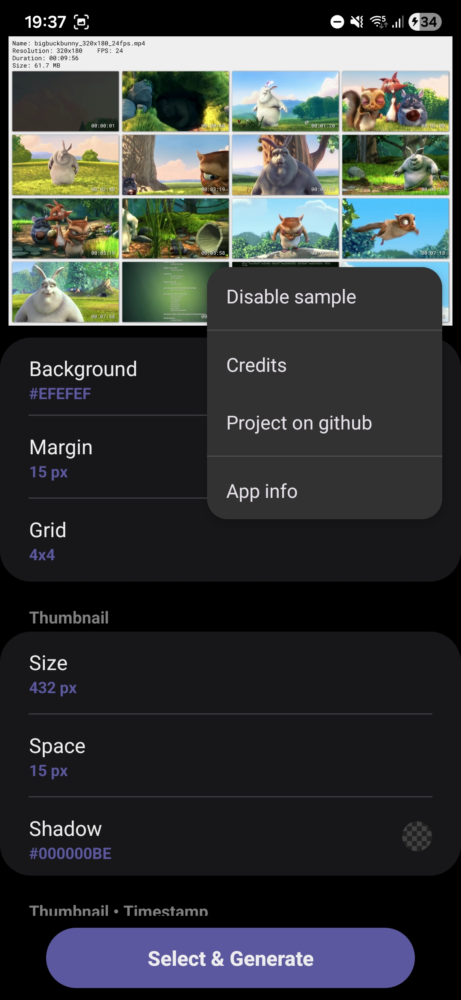
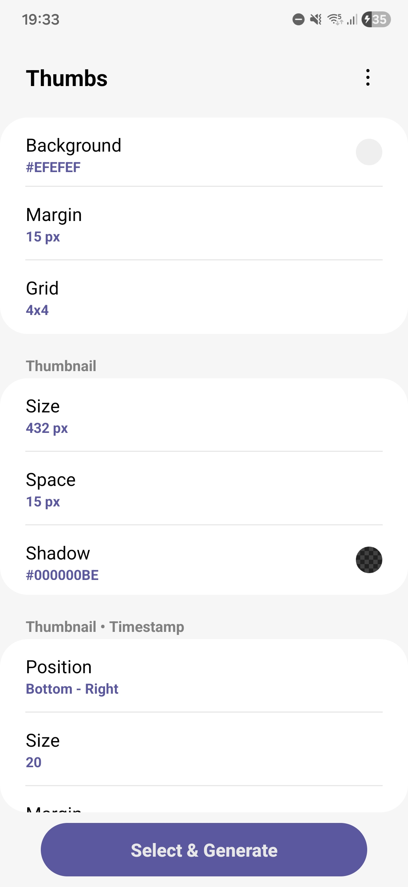
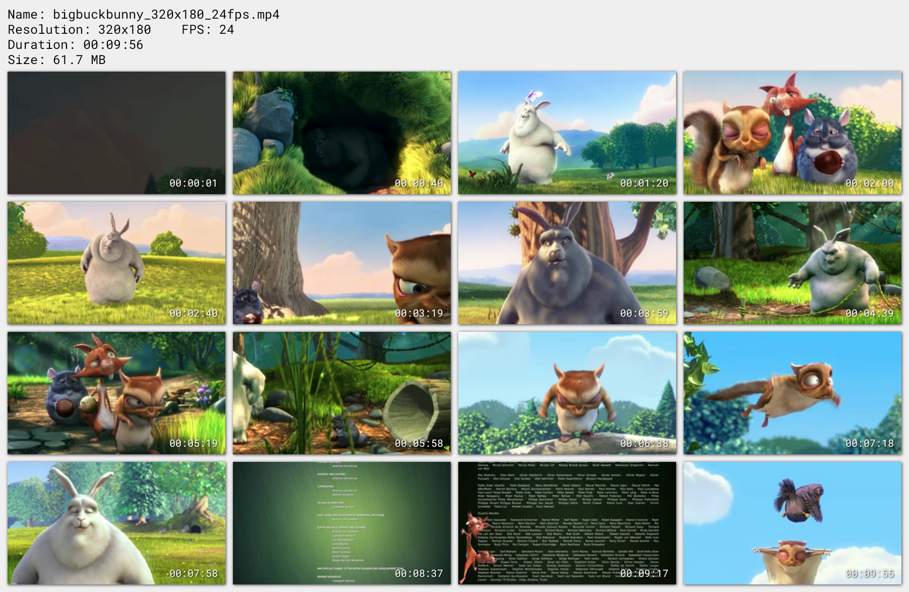
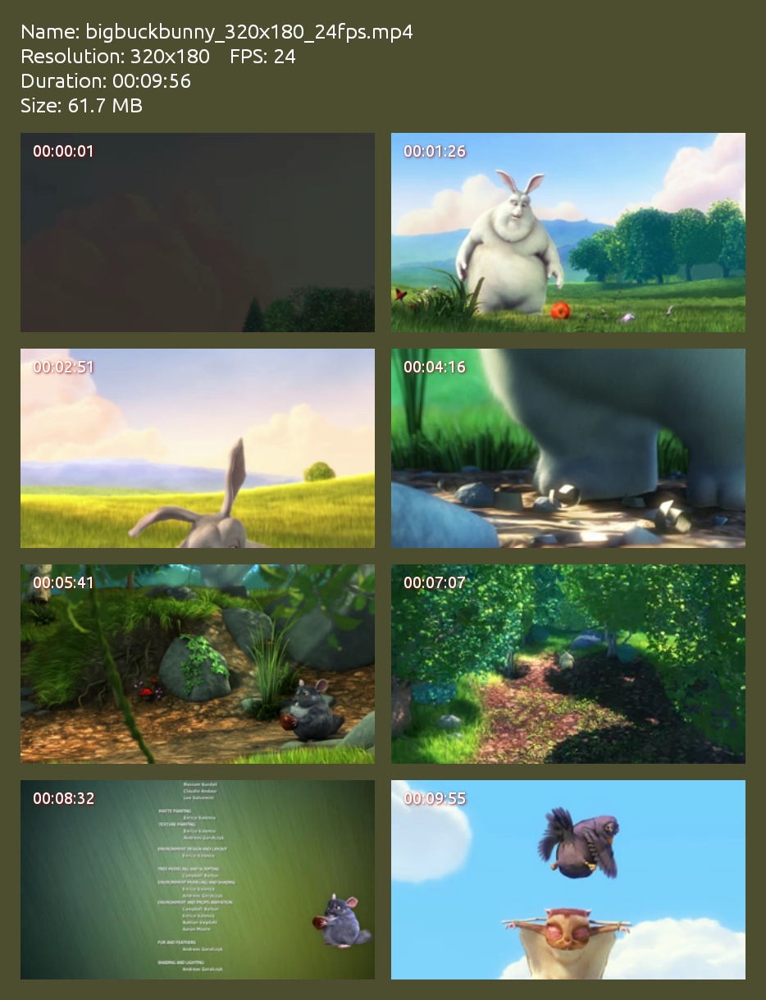

[![lang](https://img.shields.io/badge/English-gray.svg?logo=data:image/svg%2bxml;base64,PD94bWwgdmVyc2lvbj0iMS4wIj8+Cjxzdmcgd2lkdGg9IjMyIiBoZWlnaHQ9IjMyIiB4bWxucz0iaHR0cDovL3d3dy53My5vcmcvMjAwMC9zdmciIHhtbG5zOnN2Zz0iaHR0cDovL3d3dy53My5vcmcvMjAwMC9zdmciPgogPGcgY2xhc3M9ImxheWVyIj4KICA8dGl0bGU+TGF5ZXIgMTwvdGl0bGU+CiAgPHJlY3QgZmlsbD0iI2ZmZiIgaGVpZ2h0PSIyNCIgaWQ9InN2Z18xIiByeD0iNCIgcnk9IjQiIHdpZHRoPSIzMCIgeD0iMSIgeT0iNCIvPgogIDxwYXRoIGQ9Im0xLjY0LDUuODVsMjguNzIsMGMtMC43MSwtMS4xMSAtMS45NSwtMS44NSAtMy4zNiwtMS44NWwtMjIsMGMtMS40MSwwIC0yLjY1LDAuNzQgLTMuMzYsMS44NXoiIGZpbGw9IiNhNjI4NDIiIGlkPSJzdmdfMiIvPgogIDxwYXRoIGQ9Im0yLjA4LDguMjljLTAuMDEsMC4xNyAtMC4wMywwLjM0IC0wLjAzLDAuNTNsMCwyLjY1bDI5LDBsMCwtMi42NWMwLC0wLjE5IC0wLjAyLC0wLjM0IC0wLjAzLC0wLjUzbC0yOC45NCwweiIgZmlsbD0iI2E2Mjg0MiIgaWQ9InN2Z18zIi8+CiAgPHBhdGggZD0ibTIsMTQuMTFsMjksMGwwLDIuODFsLTI5LDBsMCwtMi44MXoiIGZpbGw9IiNhNjI4NDIiIGlkPSJzdmdfNSIgdHJhbnNmb3JtPSJtYXRyaXgoMSAwIDAgMSAwIDApIi8+CiAgPHBhdGggZD0ibTEsMTkuOTJsMzAsMGwwLDMuMjdsLTMwLDBsMCwtMy4yN3oiIGZpbGw9IiNhNjI4NDIiIGlkPSJzdmdfNiIgdHJhbnNmb3JtPSJtYXRyaXgoMSAwIDAgMSAwIDApIi8+CiAgPHBhdGggZD0ibTMwLjM2LDI2LjE1bC0yOC43MiwwYzAuNzEsMS4xMSAxLjk1LDEuODUgMy4zNiwxLjg1bDIyLDBjMS40MSwwIDIuNjUsLTAuNzQgMy4zNiwtMS44NXoiIGZpbGw9IiNhNjI4NDIiIGlkPSJzdmdfOCIvPgogIDxwYXRoIGQ9Im01LDRsMTEsMGwwLDEyLjkybC0xNSwwbDAsLTguOTJjMCwtMi4yMSAxLjc5LC00IDQsLTR6IiBmaWxsPSIjMTAyZDVlIiBpZD0ic3ZnXzkiLz4KICA8cGF0aCBkPSJtMjcsNGwtMjIsMGMtMi4yMSwwIC00LDEuNzkgLTQsNGwwLDE2YzAsMi4yMSAxLjc5LDQgNCw0bDIyLDBjMi4yMSwwIDQsLTEuNzkgNCwtNGwwLC0xNmMwLC0yLjIxIC0xLjc5LC00IC00LC00em0zLDIwYzAsMS42NSAtMS4zNSwzIC0zLDNsLTIyLDBjLTEuNjUsMCAtMywtMS4zNSAtMywtM2wwLC0xNmMwLC0xLjY1IDEuMzUsLTMgMywtM2wyMiwwYzEuNjUsMCAzLDEuMzUgMywzbDAsMTZ6IiBpZD0ic3ZnXzEwIiBvcGFjaXR5PSIwLjE1Ii8+CiA8L2c+Cjwvc3ZnPg==)](https://github.com/hms-douglas/rssfeed)

#  Thumbs

¹ The images are from version 1.0.1, newer versions might be different.

##
### Example of files generated

##
### Features
<ul>
  <li>Background:
    <ul>
      <li>Set color;</li>
      <li>Set margin;</li>
      <li>Set grid number (NxN, e.g: 4x4, 3x8).</li>
    </ul>
  </li>
  <li>Thumbnail (frames):
    <ul>
      <li>Set size;</li>
      <li>Set spacing;</li>
      <li>Set shadow color.</li>
    </ul>
  </li>
  <li>Timestamp:
    <ul>
      <li>Set position (bottom left, top right, center, ...);</li>
      <li>Set font size;</li>
      <li>Set space from edge;</li>
      <li>Set font and shadow color.</li>
    </ul>
  </li>
  <li>Header:
    <ul>
      <li>Select which info to show (name, resolution, fps, duration and file size);</li>
      <li>Customize the title for each info;</li>
      <li>Set the font color and size;</li>
      <li>Set the space between lines.</li>
    </ul>
  </li>
  <li>A couple of font options;</li>
  <li>Toggle high precision for the timestamp;</li>
  <li>File naming options;</li>
  <li>Select multiple files at once;</li>
  <li>UI Language:
    <ul>
      <li>English;</li>
      <li>Portuguese.</li>
    </ul>
  </li>
</ul>

##
### Download ¹

 
 
¹ All apks listed inside this repository were built by me and are not minified.

##
### Donations
- If you would like to support me, you can use one of the options bellow... Thank you! ❤️

  

 Coin | Address
----|----|
Bitcoin | 3NkK4LMwMhKefe2phqf7Vrp1uQynu1Gs6x
Ethereum | 0xfea5dd21ebf73c5b4a2445c7713f6b5316dfac4d

##
### Log
<b>v1.0.1</b>
<ul>
  <li>Fixed a bug where some videos where being rendered with the dimensions inverted.</li>
</ul>
<b>v1.0.0</b>
<ul>
  <li>Release.</li>
</ul>

##
### License
Copyright 2026-present Douglas Silva

Licensed under the Apache License, Version 2.0 (the "License");
you may not use this file except in compliance with the License.
You may obtain a copy of the License at

     http://www.apache.org/licenses/LICENSE-2.0

Unless required by applicable law or agreed to in writing, software
distributed under the License is distributed on an "AS IS" BASIS,
WITHOUT WARRANTIES OR CONDITIONS OF ANY KIND, either express or implied.
See the License for the specific language governing permissions and
limitations under the License.
